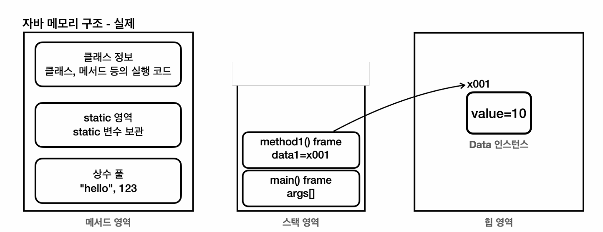
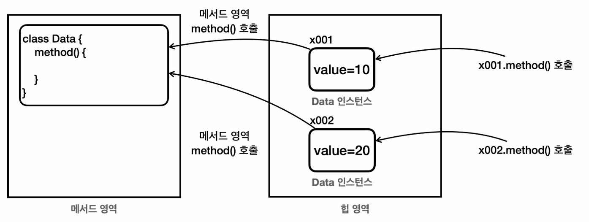

# 자바 메모리 구조

- 메서드 영역 : 프로그램을 실행하는데 필요한 공통 데이터 관리. 프로그램의 모든 영역에서 공유한다.
    - 클래스 정보 : 클래스 이름, 상속 관계, 인터페이스 정보, 필드 정보, 메서드 정보 등
    - static 영역:  static 변수, static 메서드, static 초기화 블록 등
    - 런타임 상수 풀 : 프로그램을 실행하는데 필요한 공통 리터럴 상수를 보관. ex) 프로그램에 "hello" 라는 문자열이 있다면, 이 문자열은 메서드 영역의 런타임 상수 풀에 저장된다. 
   이외에도 프로그램을 효율적으로 관리하기 위한 상수들을 관리
- 스택 영역 : 자바 실행 시, 하나의 실행 스택이 생성된다. 각 스택 프레임은 지역 변수, 중간 연산 결과, 메서드 호출 정보 등을 포함

  - 스택 프레임 : 스택 영역에 쌓이는 네모 박스가 하나의 스택 프레임. 메서드를 호출할 때마다 스택 프레임이 생성되고, 메서드가 종료되면 스택 프레임이 제거된다.
- 힙 영역: 객체와 배열이 생성되는 영역. 가비지 컬렉션(GC)이 이루어지는 주요 영역이며, 더 이상 참조되지 않는 객체는 GC에 의해 제거된다.
>  참고: 스택 영역은 각 쓰레드별로 하나의 실행 스택이 생성됨. 따라서 쓰레드 수 만큼 스택 영역이 생성된다.  
> 힙 영역은 모든 쓰레드가 공유하는 영역으로, 객체와 배열이 생성되는 곳이다. 

- 각각의 인스턴스는 내부에 변수와 메서드를 가진다. 필드에는 각각 다른 값을 넣기 때문에 생성하는게 맞음. 같은 클래스로 부터 생성된 객체라도, 인스턴스 내부의 변수 값은 서로 다를 수 있지만,  메서드는 공통된 코드를 공유한다. 
- 따라서 객체가 생성될 때, 인스턴스 변수에는 메모리가 할당되지만, 메서드에 대한 새로운 메모리 할당은 없다. **메서드는 메서드 영역에서 공통으로 관리되고 실행**된다.